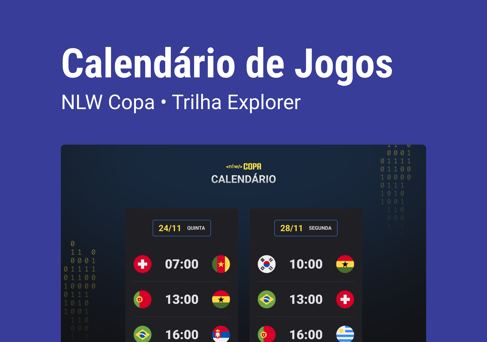

<h1 align="center">
  NLW COPA - Explorer
</h1>

  <a href="#-projeto">Projeto</a>&nbsp;&nbsp;&nbsp;|&nbsp;&nbsp;&nbsp;
  <a href="#-layout">Layout</a>&nbsp;&nbsp;&nbsp;|&nbsp;&nbsp;&nbsp;
  <a href="#-tecnologias">Tecnologias</a>&nbsp;&nbsp;&nbsp;|&nbsp;&nbsp;&nbsp;
  <a href="#-instalação">Instalação</a>&nbsp;&nbsp;&nbsp;|&nbsp;&nbsp;&nbsp;
  <a href="#memo-licença">Licença</a>

 

  

 

## 💻 Projeto

Projeto desenvolvido durante a trilha Ignite da **Next Level Week**, um evento online produzido pela [**Rocketseat**](https://github.com/Rocketseat).

O projeto consiste em um calendário para consultar os horários dos jogos.

Link do Json utilizado: https://fixturedownload.com/view/json/fifa-world-cup-2022

## 📟 Layout

O layout das telas da aplicação foi desenvolvido pela equipe da Rocketseat através do Figma. O layout pode ser acessado através deste link:
[**NLW Copa**](https://www.figma.com/community/file/1169028052212317700).

## 🚀 Tecnologias

Esse projeto foi desenvolvido com as seguintes tecnologias:

- HTML
- CSS
- JavaScript

## 📥 Instalação

Faça um clone desse repositório e abra o arquivo index.html.

## :memo: Licença

Esse projeto está sob a licença MIT. Veja o arquivo [LICENSE](LICENSE.md) para mais detalhes.

---
**Desenvolvido por [Bruno César](https://github.com/brunocs90).**
